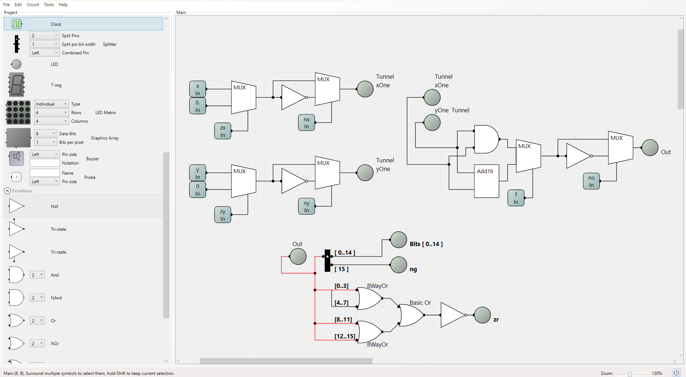

# ALU Implementation

The ALU (arithmetic logic unit) is the chip which manages a multitude of computations concerning binary numbers. As mentioned in `Project2Overview.md/`, these involve operations with both signed and unsigned bit strings. 

The bulk of the connections for the ALU were made with Mux, Not and Or gates. Some of these were single bit variants and others were 16bit variants. Note that the processing of **_zr_** was done using 8-way Or gates by splitting the positive and negative bit strings of the output. The inputs leading to the 8 way or chips have not been fully drawn to fan out into separate bits to avoid cluttering the diagram. In general however, working of this 8 way or chip can be understood from the implementation in `Project1Folder`.



Flow diagram of ALU processes:

```
   x ----┬─────────────┐
         │             │
       [zx]         [nx]
         │             │
         └───> [MUX/NOT] ──┐
                           │
   y ----┬─────────────┐   │
         │             │   │
       [zy]         [ny]   │
         │             │   │
         └───> [MUX/NOT] ──┘
                           │
                   ┌───────┴───────┐
                   │   [f selects] │
                   │  x AND y  or  │
                   │  x + y        │
                   └───────┬───────┘
                           │
                   ┌───────┴───────┐
                   │   [no]        │
                   │ Negate output │
                   └───────┬───────┘
                           │
                   ┌───────┴───────┐
                   │   [ng/zr]     │
                   │ Flags         │
                   └───────────────┘
```

From the flow diagram above, it is crucial to highlight that the ALU performs computations in stages. Values (**`flags`**) such as zx ny and  no alter the input to the next component of the ALU. This is a successive procedure meaning processing happens in the order seen in the flow diagram.