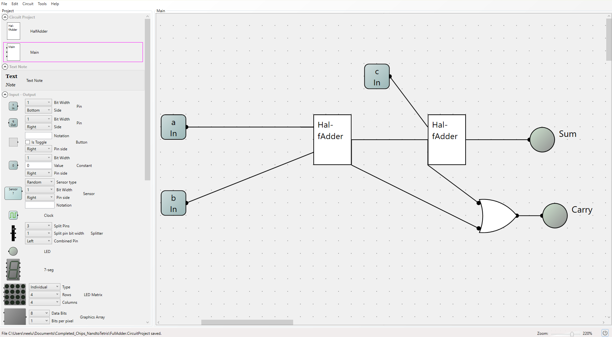

# FullAdder Implementation

The interface of the FullAdder states that the chip takes in three bits and outputs one sum and one carry. It is similar to the HalfAdder but instead of taking in two bits, it takes in three. This is why it forms the basis of the Add16 chip which was implemented next. 

The FullAdder is simply built using two two HalfAdders and an Or gate, hence it operates on the same principles as the HalfAdder.

