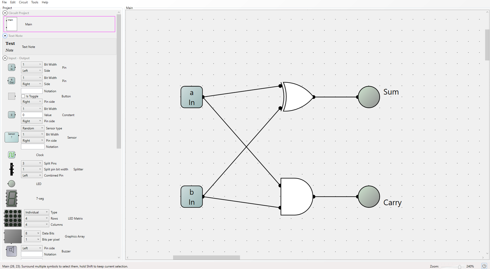

# Half Adder Implementation

 The HalfAdder shown below takes in two bits and outputs the sum and carry of these two bits. This chip forms the basis of the Full Adder which is a more complicated chip.

 

 **Example:** 
 
 for 0 + 1, sum = 1 and carry = 0
 
 for 1 + 1, sum = 0 and carry = 1

