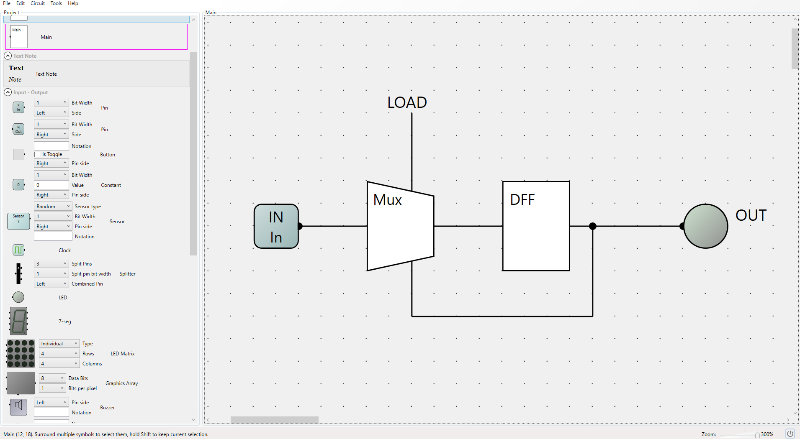

# 1-Bit Register Implementaion

1-Bit Register:



The 1-Bit Register is a crucial chip in the memory of the Hack computer. This is mainly because all RAM chips subsequently implemented after this module rely on it. 

The function of the 1-Bit Register is to store a singular bit unless specified to update this bit by the load parameter. From the implementation above we see that the output is highly relevant even within the implementation of this chip alone. We see that this output is wired back to the Mux gate at the beginning as the second input: `(b)`. This is so that the Mux gate selects which parameter - either the input `(a)` or the current output value - to pass on to the DFF. Whenever load is set to 0, the same value is circulated and hence **_stored_**. However, as soon as the load parameter is set to 1, the value changes to the output at t where `out [t] = in [t - 1]` as described in `SequentialLogic.md`.

Flow chart summarising process:

```
         +-------------------+
         |    Input (a)      |
         +--------+----------+
                  |
                  v
           +-------------+
           |    Mux      |<-------------------+
           +------+------+                    |
                  |                           |
          load=1  |   load=0                  |
                  v                           |
         +-------------------+                |
         |       DFF         |                |
         +--------+----------+                |
                  |                           |
                  v                           |
             Output (out) --------------------+
```
## 16-Bit Register

To create a full Register which has inputs and outputs of 16-Bits, we must chain these 1-Bit Registers together as we done in Project 1 with the 16-Bit implementations of the basic logic gates.