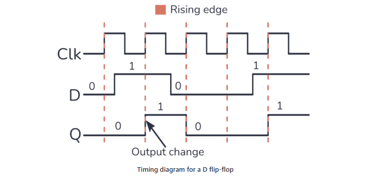

# Sequential Logic

We have two types of logic. **_Combinatorial and sequential logic_** in Project 3. The former was used heavily for the earlier Projects and has been used to less of an extent in Project 3. Sequential logic however has been used much more in this project because we are creating memory chips. As time progresses, a chip (such as the 1-Bit Register) holds a value for a certain period or time or until a certain value changes. We therefore must make use of an internal clock. This internal clock runs through its own units of time independent to real world time which gives rise to the functionality of the **`D Flip-Flop`** or `DFF`.

The above description is important because the DFF relies on an internal clock to work. An illustration is given below:

**Figure 1.** DFF clock cycle. Source: [Build Electronic Circuits](https://www.build-electronic-circuits.com/d-flip-flop/)

In the context of a DFF, sequential logic effectively delays the output by 1 unit of time after the input has changed. This effect may be seen in the graph above and it is this very aspect which allows these chips to store values and act as memory chips. This relationship is neatly described by **`out(t)=in(t - 1)`**.

In addition to this, DFF is a chip whose implementation is not covered in this course but it is worth noting it can be done using nand gates.

## Program Counter (PC)

This chip has several different functions including the following:

- Reset: Sets the _**stored value within PC**_ to 0.
- Load: Sets the _**stored value within PC**_ to either the current input IN or the last stored input by initializing load to either 0 or 1.
- Increment: Adds one to the current _**stored value within PC**_ using the binary arithmetic used in the last project (Project 2).

PC uses three types of gates to accomplish both combinatorial - setting values using Mux - and sequential operations - usage of the Register gate. It uses Register, Inc and three Mux16.

It is crucial to understand the distinction between the `stored value within PC` and the stored value within the Register used to implement the PC. For more information surrounding the Register, please view `Project3Folder/Bit.md`.
The difference between these is evident when the PC.hdl file is examined. the value of load for the Register is set to true indefinitely; the Register is not storing anything in this case. The storage of the value is happening by the 16-Bit Mux gate which sets the output to either the new or stored value depending on the state of load.