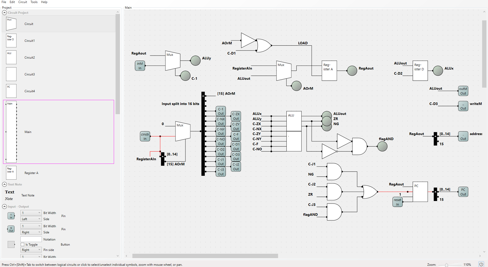

# Chip Implementation

## Memory chip:

The memory chip is where most data is stored. Crucially, as mentioned in `Memory.md` only the upper 16K+8K+1 RAM chips are valid for our implementation. The others cannot be used by _our_ program. The memory chip is split into three different categories:

- RAM chips 0 to 16383 - This range is assigned to RAM16K. It is used for storing arbitrary values as 16 bit binary strings used in general computations.

- RAM chips 16384 to 24575 - This range is assigned to the HACK computer screen where the input of each RAM chip is a 16 bit binary value. Each RAM chip represents one 4x4 pixel. There are 8192 4x4 pixels within the screen which may be verified by:

>>>**`24575-16384=8192 RAM Chips`**. Since each of these RAM chips represents 4x4 pixel (16 bits) the value of 8192 total screen pixels is correct.

- RAM chip 24576 - This singular RAM chip is designed to hold the value of the key currently pressed on the keyboard. It can be used in a variety of operations just as the other RAM chips are.

Diagram of Memory structure:

```
+-------------------+-------------------+-------------------+
|   RAM16K          |   Screen          |   Keyboard        |
| 0 - 16383         | 16384 - 24575     | 24576             |
+-------------------+-------------------+-------------------+
| General-purpose   | Each 16 bits      | Holds key code    |
| RAM for programs  | = 4x4 pixel block | of key pressed    |
+-------------------+-------------------+-------------------+
```

## Central Processing Unit (CPU)

This chip is the most technically challenging aspect of this particular project. The main reason for this is that there are a multitude of different chips to connect together within the CPU. These include:

- Registers
- ALU (Arithmetic Logic Unit)
- Mux16

The below is an image of the implementation of the CPU given as an image `.png` file:



As can be seen from the diagram of the CPU, there are five different steps to each computation:

- 1. Receive input
- 2. Determine `A or C` instruction
- 3. `Process` value
- 4. Output and `increment/jump`
- 5. Repeat from step 1

1. The input received into the CPU depends on what the PC determined should be the `next executed instruction` in the `previous cycle`.

2. The determination of whether the instruction is A or C comes from the value of the `msb` (most significant bit) of the instruction bit. 

3. If msb == 1, then C-instruction else if msb == 0, then A-instruction. in the case of an `A-instruction`, the value is treated as an ordinary 16 bit value and then immediately `loaded into Register A`. The 16 bit string loaded into the A Register becomes the memory address to which data may be written to/read from. In the case of a `C-instruction`, the various flags from the instruction bit cause the registers to input a certain `value into the ALU`. The ALU then proceeds to compute a 16 bit string which `becomes the output value`. This output value is not always written. The value of the `destination bit` determines whether it is `written to memory via an address or not.`

5. The PC determines whether to increment or jump depending on the value of load. If `load is 1` then a `jump` occurs, else the `next instruction` is executed. While this is happening, the PC has a reset function where if `reset == 1`, then the instructions begin executing from the first instruction. 

## ROM32K

This chip is given as a primitive in the project and therefore there is no detail given about its implementation. Its job however is like any other memory chip. It stores instructions used by the HACK CPU to perform computations. When the PC (Program Counter) within the CPU increments or jumps to the next instruction, the next instruction in this ROM32K chip is read from the address pointed to by the PC on the last cycle.