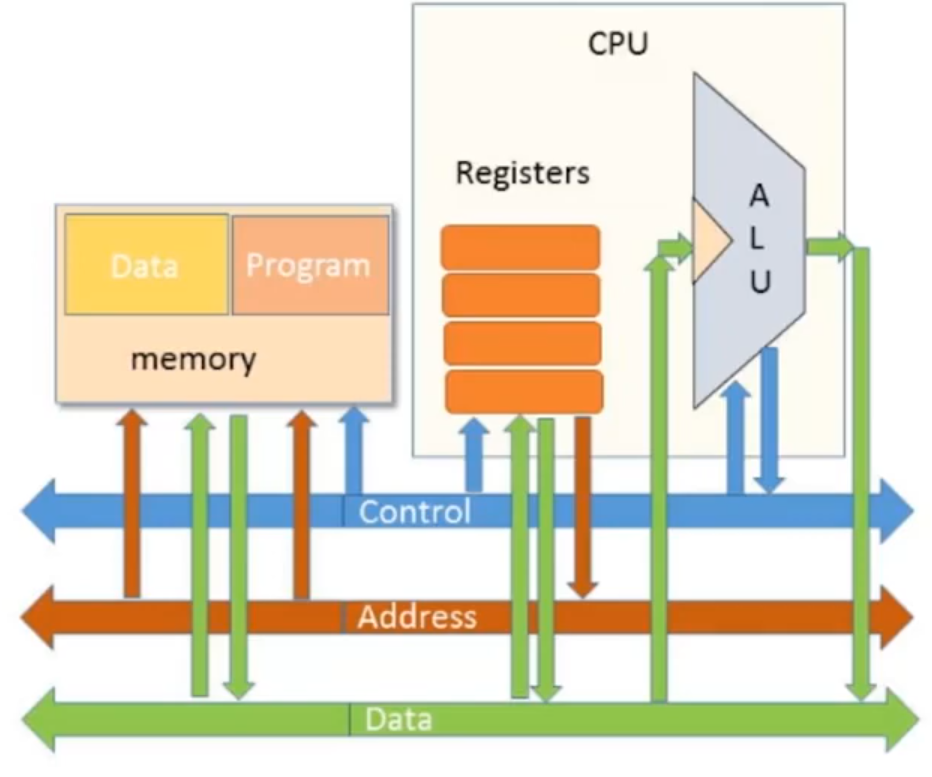

# Connections

The chaining between the three chips that form the HACK architecture is equally as important as implementing the chips themselves. The transfer of data in the form of binary values - whether these be memory addresses or bit strings to write/read - relies on this network of connections.

The chips are connected together by **`buses`** which facilitate the transfer of data across the three different chips (_CPU, ROM and Memory_). The buses which form the bulk of the architecture in the HACK computer are `16 bits wide` which is expected as the bit strings transferred between the chips have a bit width of 16 bits. There are three different types of buses in the computer; _Data, Address and control_. Each have different purposes as explained below:

- Data Bus: This bus is connected to the ALU within the CPU, the register within the CPU and the ROM and memory. The primary job of this bus is to allow the _**transfer of arbitrary values**_ used in computations by the CPU.

- Address Bus: This bus connects the Register in the CPU and the Memory chip. The computations the CPU performs are diverse; however, all of them have one thing in common: instructions will almost always involve reading or writing data to memory. However, to make this possible, registers within the CPU must store the address of certain RAM chips to be accessed. _**These addresses are what are transferred using the address bus**_.

- Control Bus: This bus is primarily the route which all control signals take. The control bus connects components within the CPU with memory and serves as a means for _**instructing which computations each chip should perform**_ through the control signals it transfers.

Note: _See `Chips.md` for further context of this file._

Below is a diagram summarizing these connections:

